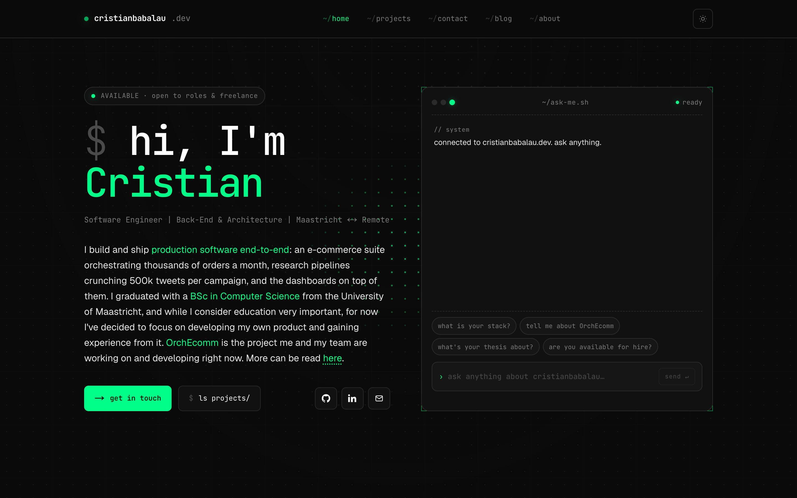
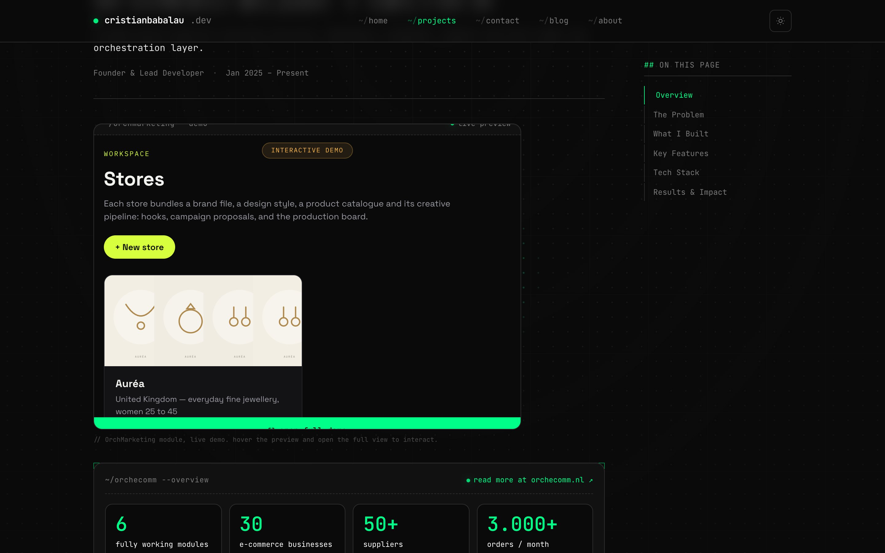
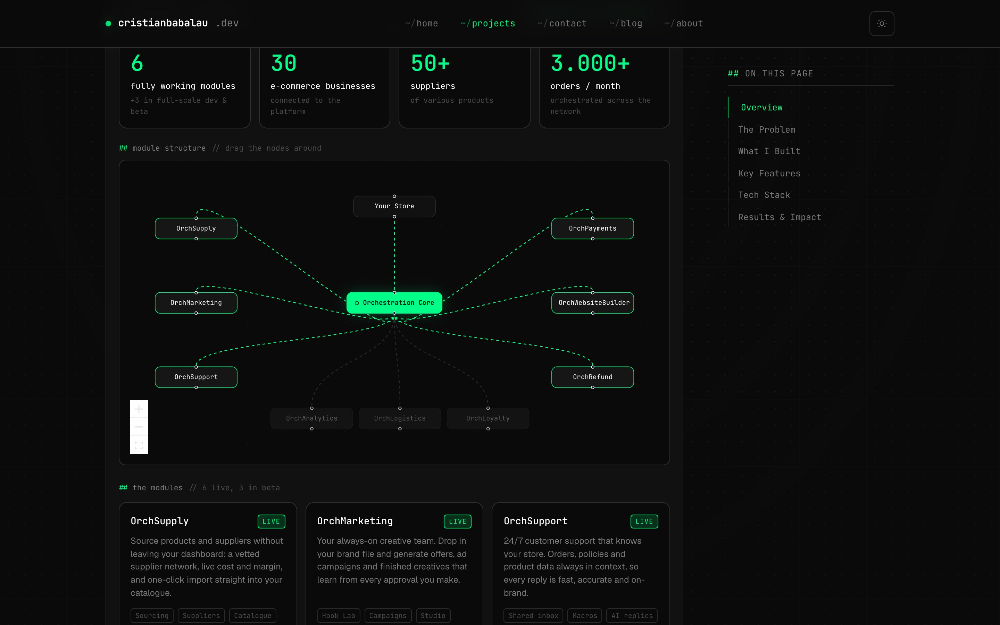
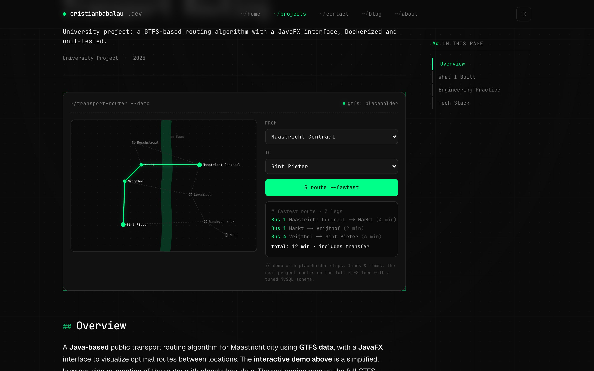
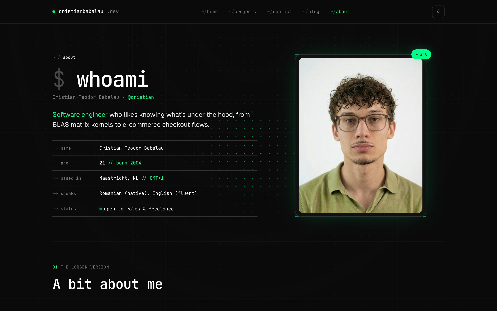

# cristianbabalau.dev

My personal portfolio — a terminal-styled site built with Next.js 16 and Tailwind CSS v4.
Dark/light theming, a mouse-torch background, a CV-aware chat terminal, an interactive
transport router, and an embedded live demo of my product OrchEcomm.

**Live:** https://cristianbabalau-portfolio.netlify.app



## Screenshots

| OrchEcomm — embedded live demo | OrchEcomm — module map |
| --- | --- |
|  |  |
| **Maastricht transport router** | **About** |
|  |  |

## Stack

- **Next.js 16** (App Router), **React 19**, **TypeScript**, **Tailwind CSS v4**
- Interactive bits: **React Flow** (module map), a custom SVG/Dijkstra routing demo
- Deployed on **Netlify**; also ships as a slim multi-stage **Docker** image

## Run locally

```bash
npm install
npm run dev   # http://localhost:3000
```

All content lives in typed data files under `src/data/` (`site`, `projects`,
`posts`, `about`, `chat`), so the whole site re-renders from there.
